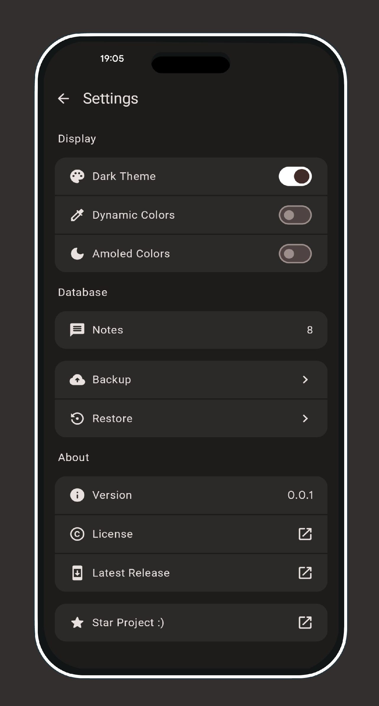
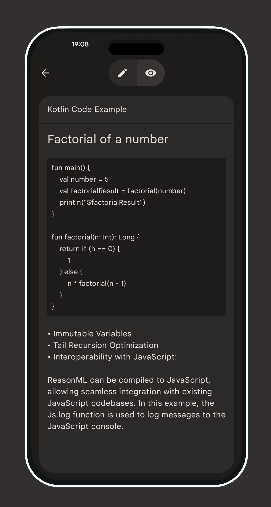

  

# Easy Notes
Lightweight android notes app with Material You.
  

    
    
    

 

---

## 📥 Download

--- 
## 📢 News
- [Join Discord Server](https://discord.gg/ZrP4G8z23H)
- [Bug with Images Disappearing in New Builds (up from v1.2)](https://github.com/Kin69/EasyNotes/discussions/29)
- [Vote For Community Server](https://github.com/Kin69/EasyNotes/discussions/22)

---

## 📝 Overview
- [x] Material Design 3
- [x] Jetpack Compose and MVVM
- [x] Lightweight (~11Mb)
- [x] Multiple themes

---

## 💬 Contact Me

-  Email : k1nS4@proton.me
-  Discord : .kin69.

  ---
## 🛠️ Implementation

 For the latest updates and status of the project, please refer to the [STATUS.md](./STATUS.md) file.
  
- [x] Initial setup of project
- [x] Implementation of core features
- [x] UI design with Material You
- [x] Integration of Jetpack Compose and MVVM
- [x] Basic themes support

---
## 🌍 Translation

---
## ⚠️ License

    Copyright (c)2024 kin69
    
    This program is free software: you can redistribute it and/or modify
    it under the terms of the GNU General Public License as published by
    the Free Software Foundation, either version 3 of the License, or
    (at your option) any later version.
    
    This program is distributed in the hope that it will be useful,
    but WITHOUT ANY WARRANTY; without even the implied warranty of
    MERCHANTABILITY or FITNESS FOR A PARTICULAR PURPOSE. See the
    GNU General Public License for more details.
    
    The above copyright notice, this permission notice, and its license shall be included in all copies or substantial portions of the Software.
    
    You can find a copy of the GNU General Public License v3 [here](https://www.gnu.org/licenses/)

