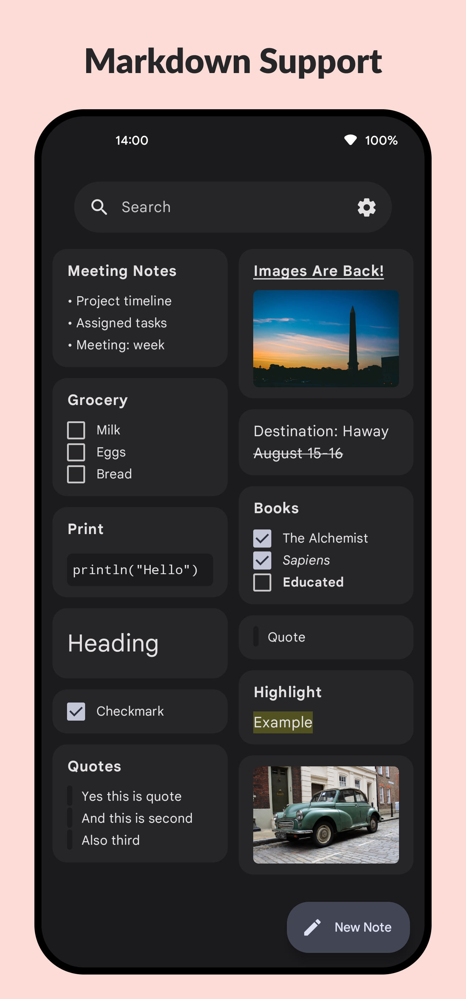
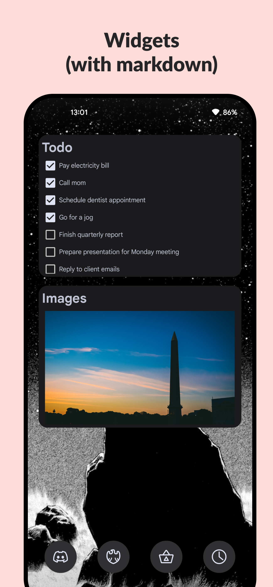

  

# Easy Notes
Lightweight android notes app with Material You.

 &nbsp; 
 &nbsp;

 &nbsp;

---

    
    
    

--- 
## 📢 News
- [Telegram](https://t.me/EasyApps69)
- [Discord Server](https://discord.gg/ZrP4G8z23H)
- [Images Support Back!](https://github.com/Kin69/EasyNotes/discussions/29)

---

## 🎉 Features
- 📝 Sleek, Minimalistic Design
- 🌟 Full Markdown Support (Images Included)
- 🔒 Secure, Encrypted Notes Vault
- 🚀 Constant Updates & Improvements
- 🔐 Zero Permissions Required

---

## 💬 Contact Me

-  Email : Vexzure@proton.me
-  Discord : [Easy Notes](https://discord.gg/ZrP4G8z23H)

---
## 🌍 Translation - [Weblate](https://hosted.weblate.org/projects/easy-notes/) (Your contributions to translations are greatly appreciated)

---
## ⚠️ License
    Easy Notes

    Copyright (c)2024 kin69
    
    This program is free software: you can redistribute it and/or modify
    it under the terms of the GNU General Public License as published by
    the Free Software Foundation, either version 3 of the License, or
    (at your option) any later version.
    
    This program is distributed in the hope that it will be useful,
    but WITHOUT ANY WARRANTY; without even the implied warranty of
    MERCHANTABILITY or FITNESS FOR A PARTICULAR PURPOSE. See the
    GNU General Public License for more details.
    
    The above copyright notice, this permission notice, and its license shall be included in all copies or substantial portions of the Software.
    
    You can find a copy of the GNU General Public License v3 [here](https://www.gnu.org/licenses/)

