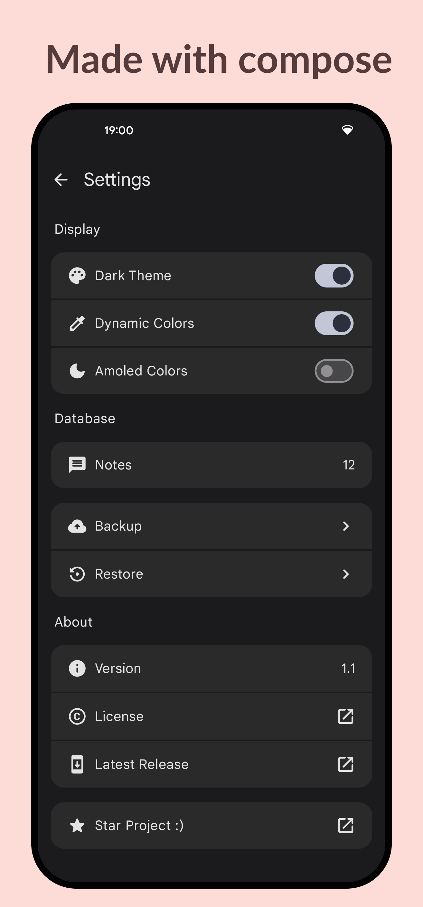
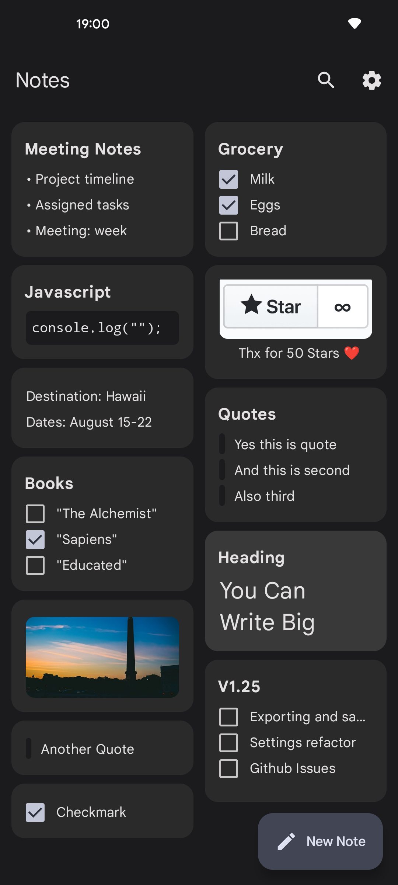

  

# Easy Notes
Lightweight android notes app with Material You.
  

    
    
    

 

---

## 📥 Download

---

## 📝 Overview
- [x] Material Design 3
- [x] Jetpack Compose and MVVM
- [x] Lightweight (~5.91 Mb)
- [x] Multiple themes

---

## 💬 Contact Me

-  Email : k1nS4@proton.me
-  Discord : Not Yet

  ---
## 🛠️ Implementation

- [x] Basic Layout
- [x] Themes Control
- [x] Animations
- [ ] Exporting
- [ ] Widget
- [ ] Option to select todo

---

## ⚠️ Copyright

    Copyright (c)2024 kin69
    
    This program is free software: you can redistribute it and/or modify
    it under the terms of the GNU General Public License as published by
    the Free Software Foundation, either version 3 of the License, or
    (at your option) any later version.
    
    This program is distributed in the hope that it will be useful,
    but WITHOUT ANY WARRANTY; without even the implied warranty of
    MERCHANTABILITY or FITNESS FOR A PARTICULAR PURPOSE. See the
    GNU General Public License for more details.
    
    The above copyright notice, this permission notice, and its license shall be included in all copies or substantial portions of the Software.
    
    You can find a copy of the GNU General Public License v3 [here](https://www.gnu.org/licenses/)

