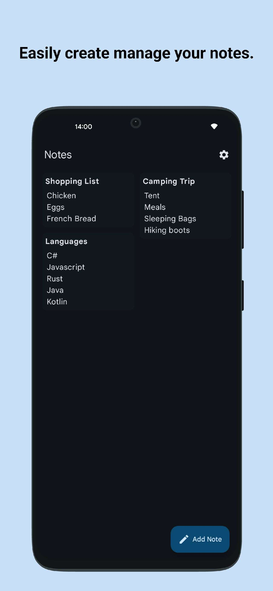
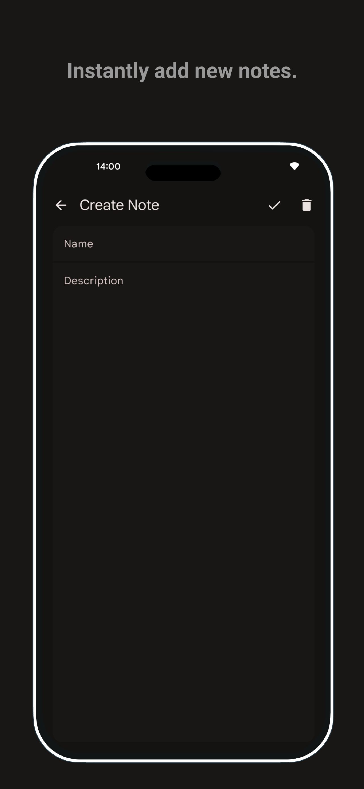
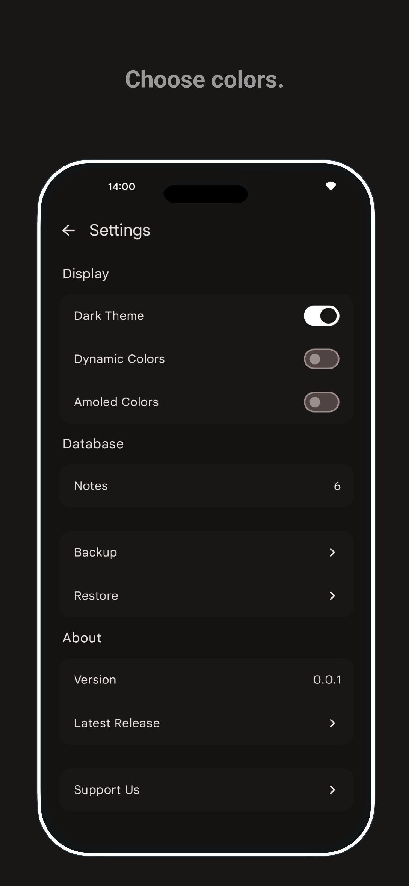

# Easy Notes

## Features

* Material Design 3
* Jetpack Compose and MVVM
* Animations
* Multiple themes

## Screenshots

    
    
    

## Download

## Building and Installation

### 1. Install Android Studio
- Ensure that you have the latest version of [Android Studio](https://developer.android.com/studio) installed on your workstation.

### 2. Repository Cloning
- Launch Android Studio and opt for `"project from Version Control."`
  - Proceed by pasting the repository URL to clone the project locally.

### 3. Building the Application Package (APK)
- Within Android Studio, navigate to **Build > Build Bundle(s) / APK(s)**.
- If necessary, generate a new keystore by selecting `"Create New Keystore"` and inputting the requisite details, including a password.
- Allow the build process to execute until completion.

For comprehensive guidance and troubleshooting, consult the official [Android Studio documentation](https://developer.android.com/studio).

